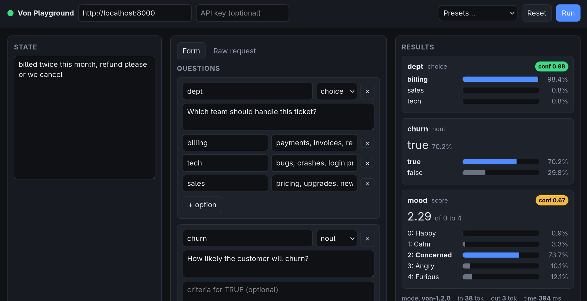

# Von Playground

Run [Von](https://github.com/wfzyx/von), an open-source System One decision model with a Jev-compatible `/v1/systemone` API, on CPU with Docker Compose, plus a small browser playground for trying it out.

Von answers three kinds of questions about a piece of text or JSON ("state"):

- **choice**: pick one option from a set, with a probability per option.
- **score**: place the state on an ordered scale of 2 to 10 levels.
- **noul**: a yes/no probability.

Inference on CPU takes roughly 0.3 s per request once the model is warm.

## Requirements

- Docker with Compose v2 (`docker compose`, not `docker-compose`).
- About 4 GB of RAM for the model container and 3 GB of disk for the weights.
- Node 18 or newer only if you want to run the UI unit tests.

## Quick start

```bash
git clone git@github.com:mateuszbieniek/von-playground.git
cd von-playground
docker compose up -d --build
```

The first start builds the image (a minute or two) and then, on the first request, downloads about 3 GB of model weights from Hugging Face. On a 100 Mbit/s connection that is roughly 5 minutes; on slower links plan for 15 minutes or more. Weights land in a Docker volume, so later starts take only the 30 seconds or so needed to load the model into memory.

You do not have to wait for the download to finish before opening the playground: its status dot stays amber until the model has answered a request, then turns green. `docker compose ps` shows the same thing as `healthy` on the `von` service.

If you would rather block until the model is ready, for example in a script, add `--wait`:

```bash
docker compose up -d --build --wait
```

It returns once the health check, which sends a real inference request, has passed. The health check allows 10 minutes for the first start; on a very slow connection `--wait` may give up with a non-zero exit while the download continues in the background. Just wait and check `docker compose ps`.

Then open the playground at <http://localhost:3000>. The API itself listens on <http://localhost:8000>.

## The playground



A single static page, no build step, served by nginx from the `ui/` directory.

- Write the state as plain text or as a JSON object or array.
- Add questions with the form, or switch to **Raw request** to edit the full JSON body.
- **Run** (or `Ctrl+Enter`) sends the request straight from the browser to Von, which allows cross-origin calls by default.
- Results show a bar per option, the confidence for choice and score answers, the model name, token usage, and wall time.
- A **curl** panel shows the equivalent command for the last request.
- The dot in the toolbar is grey until checked, red when Von is unreachable, amber when Von is up but has not answered an inference request yet, and green once it has.
- Four presets live under **Presets**: one per question type, plus "Article tags", which asks one `noul` per tag to pick several tags from a list.

The API base URL can be changed in the toolbar (or with `?api=http://host:port` in the page URL) and is remembered in the browser. If Von runs with an API key, paste it into the key field; it is kept in memory only.

## Calling the API directly

```bash
curl -s localhost:8000/v1/systemone -H 'content-type: application/json' -d '{
  "state": {"body": "billed twice, refund please or we cancel"},
  "questions": {
    "dept":  {"type": "choice", "instructions": "which team?", "criteria": {"billing": "refunds", "tech": "bugs"}},
    "anger": {"type": "score",  "instructions": "how angry?",  "criteria": ["calm", "annoyed", "furious"]},
    "churn": {"type": "noul",   "instructions": "will they cancel?"}
  }
}'
```

Response shape: `model` (always `von-1.2.0`), `answers` keyed by question name, and `usage` with input and output token counts. Choice answers carry `choice`, `probabilities`, and `confidence`; score answers carry `score`, `confidence`, `legend`, and `probabilities` keyed by level index; noul answers carry only `noul`, the probability of true.

Errors from the engine, including validation problems, come back as HTTP 422 with a `detail` field. A missing or wrong API key gives 401.

## Configuration

Set these in the shell or in a `.env` file next to `docker-compose.yml`.

| Variable | Default | Meaning |
|---|---|---|
| `VON_PORT` | `8000` | API port. |
| `VON_BIND_ADDRESS` | `127.0.0.1` | Interface the API is published on. Set an API key before opening this to `0.0.0.0`. |
| `VON_API_KEY` | empty | Optional bearer token required on `/v1/systemone`. |
| `VON_THREADS` | `4` | CPU threads for inference. Keep at or below your physical core count. |
| `VON_CORS_ORIGINS` | `*` | Comma-separated origins allowed to call the API from a browser. |
| `HF_TOKEN`, `HF_HUB_OFFLINE` | empty, `0` | Hugging Face access. The checkpoint is public. Set `HF_HUB_OFFLINE=1` to stop the container checking for newer weights on start. |
| `PLAYGROUND_PORT` | `3000` | Playground port. |
| `PLAYGROUND_BIND_ADDRESS` | `127.0.0.1` | Interface the playground is published on. |

Build-time variables, also read from the shell or `.env`:

| Variable | Default | Meaning |
|---|---|---|
| `VON_VERSION` | empty | Empty installs the latest `von-sdk` release from PyPI. Set a version such as `1.2.2` to pin. |
| `VON_REFRESH` | `0` | Cache-bust for the `von-sdk` layer. Pass any new value to force a fresh install. |

`TORCH_VERSION` (the CPU torch wheel) is fixed in `docker-compose.yml`; Von only requires `torch>=2.0.0`, so it rarely needs to move.

## Updating Von

Two things can change upstream: the `von-sdk` package on PyPI (the server and API code) and the model weights on Hugging Face (`wfzyx/von`).

**Package.** The image installs the latest `von-sdk` at build time, but Docker caches that layer, so a plain rebuild will not notice a new release. Force the layer to rebuild:

```bash
VON_REFRESH=$(date +%s) docker compose up -d --build --wait von
curl -s localhost:8000/health        # "version" shows what is now running
```

Only the `von-sdk` layer is rebuilt; the torch layer stays cached, so this takes about a minute. To see whether an update exists before rebuilding, compare the `version` from `/health` with <https://pypi.org/project/von-sdk/>.

If a release breaks something, pin the last good version in `.env` and rebuild the same way:

```bash
echo 'VON_VERSION=1.2.2' >> .env
VON_REFRESH=$(date +%s) docker compose up -d --build --wait von
```

**Weights.** Von downloads the weights from Hugging Face on first use and caches them in the `von-models` volume, keyed by the upstream commit. When Hugging Face has a newer commit, the next container start downloads it automatically as long as the container is online (`HF_HUB_OFFLINE` is `0`). Old snapshots stay on disk; to reclaim the space, or to force a clean re-download, drop the volume:

```bash
docker compose down -v
docker compose up -d --wait
```

That re-downloads about 3 GB.

## Day-to-day commands

```bash
docker compose ps                 # "healthy" on von means the model is serving
docker compose logs -f von        # server logs
docker compose restart von        # weights stay in the von-models volume
docker compose down               # stop everything, keep weights
docker compose down -v            # stop and delete the weights (re-downloaded next start)
node --test ui/model.test.js      # unit tests for the pure UI module
node --check ui/app.js            # syntax check for the DOM module
```

## Layout

```
Dockerfile            builds von-sdk on python:3.12-slim with CPU-only torch
docker-compose.yml    services: von (API) and playground (nginx serving ui/)
healthcheck.py        readiness probe: sends a real request, not just /health
ui/                   the playground: index.html, style.css, app.js, model.js, model.test.js
docs/superpowers/     design spec and implementation plan for the playground
```

## Notes

- `GET /health` reports `ok` before the weights are loaded. Use `docker compose ps` or a real request to know the model is ready.
- The container runs as a non-root user; the weights volume is created with matching ownership so the first download can write to it.
- If the build or the weight download fails with `Network is unreachable` inside a container while the host is online, check that `sysctl net.ipv4.ip_forward` is `1`.
- Von is a single model. The request `model` field accepts aliases such as `von-latest` or `jev-latest`, but responses are always stamped `von-1.2.0`.
